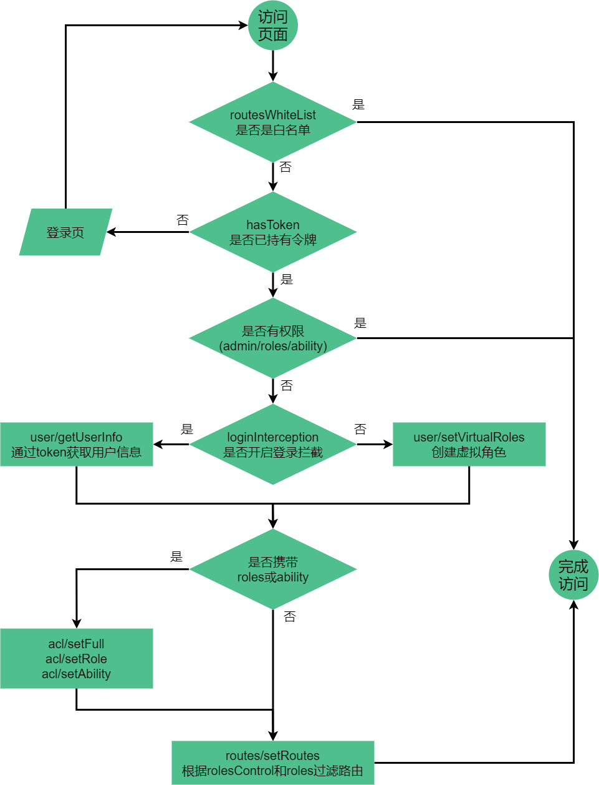

## vue 技术栈

基于 vue2.0 全家桶 + element-ui 的中后台前端开发管理框架（基于 vue/cli 4 版本）。

| 名称            | 版本号  | 名称            | 版本号   | 名称         | 版本号   |
| --------------- | ------- | --------------- | -------- | ------------ | -------- |
| @vue/cli 版本   | ^4.5.19 | vue 版本        | ~2.7.14  | vuex 版本    | ^3.6.2   |
| vue-router 版本 | ^3.6.5  | element-ui 版本 | ^2.15.14 | axios 版本   | ^1.7.3   |
| eslint 版本     | ^6.8.0  | prettier 版本   | ^2.8.8   | sass 版本    | ~1.32.13 |
| mockjs 版本     | ^1.1.0  | lodash 版本     | ^4.17.21 | layouts 版本 | 自定义   |

## 项目结构信息

```bash

"name": "qcloud-customer-web",
"version": "9.0",
"private": true,
"author": "",
"participants": [],
"homepage": "",
"scripts": {
  "serve": "vue-cli-service serve --mode development",
  "build": "vue-cli-service build  --mode production",
  "proCucc": "vue-cli-service build --mode cucc",
  "proYdn": "vue-cli-service build --mode ydn",
  "proYdnys": "vue-cli-service build --mode ydnys",
  "proPre": "vue-cli-service build --mode pre",
  "proWdm": "vue-cli-service build --mode wdm",
  "proWdmpre": "vue-cli-service build --mode wdmpre",
  "proHd": "vue-cli-service build --mode hd",
  "proMh": "vue-cli-service build --mode mh",
  "proYbh": "vue-cli-service build --mode ybh",
  "proHr": "vue-cli-service build --mode hr",
  "proHrys": "vue-cli-service build --mode hrys",
  "proJy": "vue-cli-service build --mode jy",
  "proJypre": "vue-cli-service build --mode jypre",
  "proHcsf": "vue-cli-service build --mode hcsf",
  "proHcsfpre": "vue-cli-service build --mode hcsfpre",
  "proXjlh": "vue-cli-service build --mode xjlh",
  "proXjlhpre": "vue-cli-service build --mode xjlhpre",
  "proFjcy": "vue-cli-service build --mode fjcy",
  "proFjcypre": "vue-cli-service build --mode fjcypre",
  "proXy": "vue-cli-service build --mode xy",
  "proXypre": "vue-cli-service build --mode xypre",
  "proTh": "vue-cli-service build --mode th",
  "proThpre": "vue-cli-service build --mode thpre",
  "proFk": "vue-cli-service build --mode fk",
  "proFkpre": "vue-cli-service build --mode fkpre",
  "proYy": "vue-cli-service build --mode yy",
  "proYypre": "vue-cli-service build --mode yypre",
  "proJiny": "vue-cli-service build --mode jiny",
  "proJinypre": "vue-cli-service build --mode jinypre",
  "build:report": "vue-cli-service build --report",
  "lint": "vue-cli-service lint --fix",
  "inspect": "vue-cli-service inspect",
  "clear": "rimraf node_modules&&npm i&&increase-memory-limit",
  "increase-memory-limit": "increase-memory-limit",
  "doc": "docsify serve docs"
},
"devDependencies": {
    "@babel/register": "^7.12.1",
    "@vue/cli-plugin-babel": "^4.5.8",
    "@vue/cli-plugin-eslint": "^4.5.8",
    "@vue/cli-plugin-router": "^4.5.8",
    "@vue/cli-plugin-vuex": "^4.5.8",
    "@vue/cli-service": "^4.5.8",
    "@vue/eslint-config-prettier": "^6.0.0",
    "autoprefixer": "^10.0.1",
    "babel-eslint": "^10.1.0",
    "babel-plugin-dynamic-import-node": "^2.3.3",
    "babel-plugin-transform-remove-console": "^6.9.4",
    "compression-webpack-plugin": "^6.0.4",
    "docsify-cli": "^4.4.3",
    "eslint": "^7.12.1",
    "eslint-plugin-prettier": "^3.1.4",
    "eslint-plugin-vue": "^7.1.0",
    "filemanager-webpack-plugin": "^2.0.5",
    "husky": "^4.3.0",
    "increase-memory-limit": "^1.0.7",
    "lint-staged": "^10.5.1",
    "mockjs": "^1.1.0",
    "node-sass": "^4.14.1",
    "prettier": "^2.1.2",
    "sass-loader": "^7.1.0",
    "script-loader": "^0.7.2",
    "stylelint": "^13.7.2",
    "stylelint-config-prettier": "^8.0.2",
    "svg-sprite-loader": "^5.0.0",
    "vue-directive-ellipsis": "^1.0.4",
    "vue-template-compiler": "^2.6.12",
    "webpackbar": "^4.0.0"
  },


```

## 路由拦截流程


