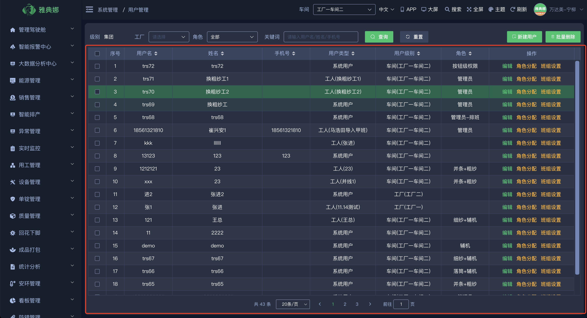
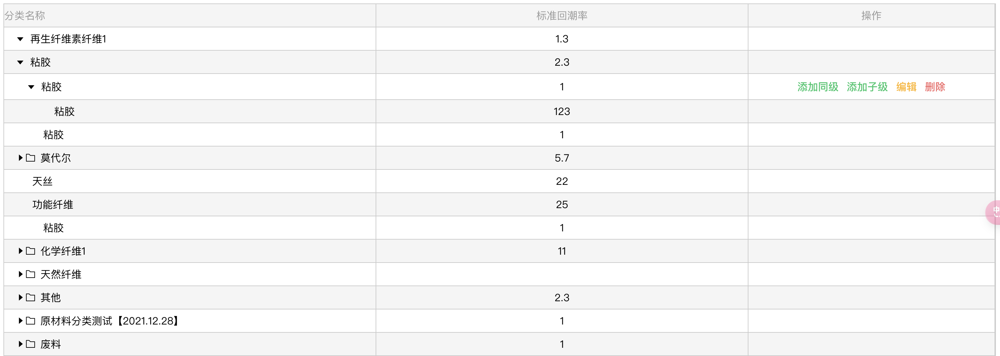
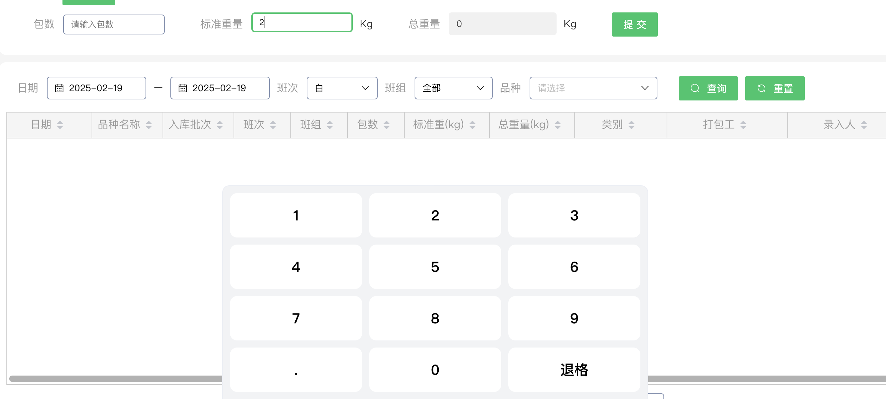
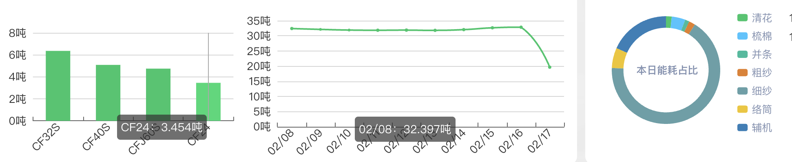

# 通用 UI 组件

在 Web 应用开发中，通用 UI 组件能够提高开发效率，保持界面的一致性。PC 端主要依赖的组件库是 [ElementUI](https://element.eleme.cn/#/zh-CN)。以下是一些常用的通用 UI 组件示例，更多组件请参考 ElementUI 官方组件库。

### 通用表格

**el-table**

- 介绍：`el-table` 是 Element UI 提供的一个基于 Vue 2.0 的表格组件，适用于展示大量数据。
- 特点：支持自定义列、排序、筛选、分页等功能。
- 代码示例:

  ```vue
  <template>
    <el-table :data="tableData" style="width: 100%">
      <el-table-column prop="date" label="日期" width="180"></el-table-column>
      <el-table-column prop="name" label="姓名" width="180"></el-table-column>
      <el-table-column prop="address" label="地址"></el-table-column>
    </el-table>
  </template>
  <script>
    export default {
      data() {
        return {
          tableData: [
            {
              date: "2025-02-19",
              name: "张三",
              address: "上海市普陀区金沙江路 1518 弄",
            },
            {
              date: "2025-02-20",
              name: "李四",
              address: "上海市普陀区金沙江路 1517 弄",
            },
          ],
        };
      },
    };
  </script>
  ```

  

### 高级表格

**vxe-table**

- 介绍：`vxe-table` 是一个基于 Vue 2.0/3.0 的表格解决方案，提供了丰富的功能。
- 特点：支持虚拟滚动、大数据量处理、列固定、表头分组等高级特性。
- 代码示例:

  ```vue
  <template>
    <vxe-table :data="dataList" height="400">
      <vxe-column type="seq" title="序号" />
      <vxe-column field="category" title="分类" />
    </vxe-table>
  </template>
  <script>
    export default {
      data() {
        return {
          dataList: [{ category: "电子产品" }, { category: "家用电器" }],
        };
      },
    };
  </script>
  ```

### 通用弹框

**el-dialog**

- 介绍：`el-dialog` 是 Element UI 的对话框组件，用于显示信息、提示或收集用户输入。
- 特点：支持自定义标题、内容、底部操作按钮等。
- 代码示例:

  ```vue
  <template>
    <el-dialog title="提示" :visible.sync="dialogVisible">
      <span>这是一段信息</span>
      <span slot="footer" class="dialog-footer">
        <el-button @click="dialogVisible = false">取消</el-button>
        <el-button type="primary" @click="dialogVisible = false">
          确定
        </el-button>
      </span>
    </el-dialog>
    <el-button type="text" @click="dialogVisible = true">
      点击打开 Dialog
    </el-button>
  </template>
  <script>
    export default {
      data() {
        return {
          dialogVisible: false,
        };
      },
    };
  </script>
  ```

### 通用消息提示

**\$message**

- 介绍：`$message` 是 Element UI 的消息提示组件，用于展示简短的消息。
- 特点：支持成功、警告、消息、错误四种类型，可自定义显示时长和关闭回调。
- 代码示例:

  ```vue
  <template>
    <el-button @click="openMessage">点击显示消息</el-button>
  </template>
  <script>
    export default {
      methods: {
        openMessage() {
          this.$message({
            message: "这是一条消息提示",
            type: "success",
          });
        },
      },
    };
  </script>
  ```

### 通用 confirm 确认框

**\$confirm**

- 介绍：`$confirm` 是 Element UI 的确认框组件，用于提示用户进行确认操作。
- 特点：支持自定义标题、内容、确认按钮和取消按钮的文字及回调函数。
- 代码示例:

  ```vue
  <template>
    <el-button @click="openConfirm">点击显示确认框</el-button>
  </template>
  <script>
    export default {
      methods: {
        openConfirm() {
          this.$confirm("此操作将永久删除该文件, 是否继续?", "提示", {
            confirmButtonText: "确定",
            cancelButtonText: "取消",
            type: "warning",
          })
            .then(() => {
              this.$message({
                type: "success",
                message: "删除成功!",
              });
            })
            .catch(() => {
              this.$message({
                type: "info",
                message: "已取消删除",
              });
            });
        },
      },
    };
  </script>
  ```

## 项目内自封装 组件示例

### 1.表格内树形数据组件

- 介绍：该组件用于在表格内展示树形结构的数据，支持展开和收起子节点。
- 特点：支持树形数据展示，便于查看和管理层级结构。
- 代码示例:

  ```vue
  <template>
    <div class="margin-right-xl">
      <input
        v-model="pag_count"
        placeholder="请输入包数"
        class="inputWrapper w-p100"
        type="text"
        maxlength="8"
        @input="oninput"
        oninput="value=value.replace(/^([0-9-]\d*\.?\d{0,2})?.*$/,'$1')"
        ref="inputWrapper1"
        @click="openKeyboard('inputWrapper1')"
      />
      <NumberKeyboard
        v-model="pag_count"
        :visible.sync="numberKeyboardVisible"
        :inputElement="inputElement"
        @change="oninput"
      />
    </div>
  </template>
  <script>
    import NumberKeyboard from "@/components/NumberKeyboard/index.vue";
    export default {
      components: {
        NumberKeyboard,
      },
    };
  </script>
  ```

  #### 表格内树形数据组件展示效果

  

  ### 2.数字键盘

- 代码示例:

  ```vue
  <template>
    <el-table
      stripe
      border
      :data="list"
      height="100%"
      tooltip-effect="dark"
      fit
    >
      <TreeTableColumn
        prop="name"
        :label="$t('variety.v1')"
        min-width="320"
      ></TreeTableColumn>
    </el-table>
  </template>
  <script>
    import TreeTableColumn from "@/components/TreeTable/index.vue";
    export default {
      components: {
        TreeTableColumn,
      },
    };
  </script>
  ```

  #### 数字键盘组件展示效果

  

## Echarts 组件

### 项目内自封装 Echarts 组件引用地址

- 介绍：该组件封装了 Echarts 图表库，提供了统一的图表展示接口，便于在项目中复用。
- 特点：支持多种图表类型，如折线图、柱状图、饼图等，支持自定义配置项。
- 代码示例:

  ```vue
  <template>
    <line-chart :opt="clLineOpt"></line-chart>
  </template>
  <script>
    import LineChart from "@/components/Echarts/LineChart";
    export default {
      components: { LineChart },
      data() {
        return {
          clLineOpt: {
            grid: {
              top: "15%",
              right: "3%",
              bottom: "15%",
            },
            xAxis: [
              {
                data: ["周一", "周二", "周三", "周四", "周五", "周六", "周日"],
              },
            ],
            series: [
              {
                type: "line",
                name: "本周",
                color: "#06C668",
                symbol: "circle",
                data: [17.49, 20.34, 25.67, 30.12, 35.89, 40.23, 45.67],
              },
              {
                type: "line",
                name: "上周",
                color: "#32C5FF",
                symbol: "circle",
                data: [0.79, 1.34, 2.67, 3.12, 4.89, 5.23, 6.67],
              },
            ],
          },
        };
      },
    };
  </script>
  ```

### 项目内自封装 Echarts 组件展示效果



## 公用业务组件

以下是一些针对特定业务场景的公用组件，它们可以根据项目需求进行定制和扩展。

### 全局查询工序/选择组件

- 介绍：该组件用于全局查询工序信息，支持模糊搜索、筛选等功能。
- 特点：提高工序信息录入效率，减少重复操作。

### 全局工人选择组件

- 介绍：该组件用于选择工人信息，支持多条件筛选。
- 特点：方便快捷地选择工人，支持批量操作。

### 全局品种选择组件

- 介绍：该组件用于选择产品品种信息，支持分类展示和筛选。
- 特点：简化品种选择流程，提高数据准确性。

### 全局机台选择组件

- 介绍：该组件用于选择机台信息，支持机台状态展示和筛选。
- 特点：实时展示机台状态，便于生产调度和管理。
