## UI 规范相关

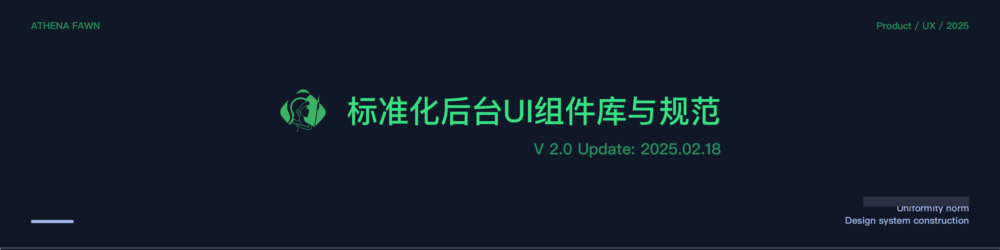

> #### 1、色彩样式

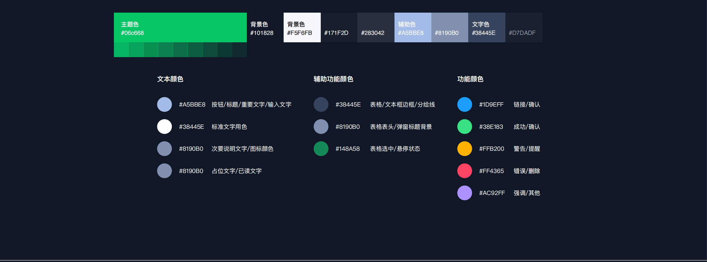

> #### 2、渐变色

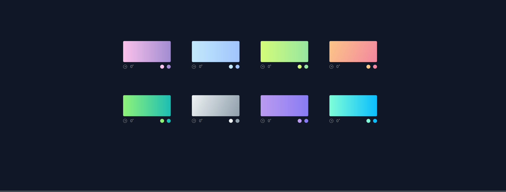

> #### 3、功能配⾊组

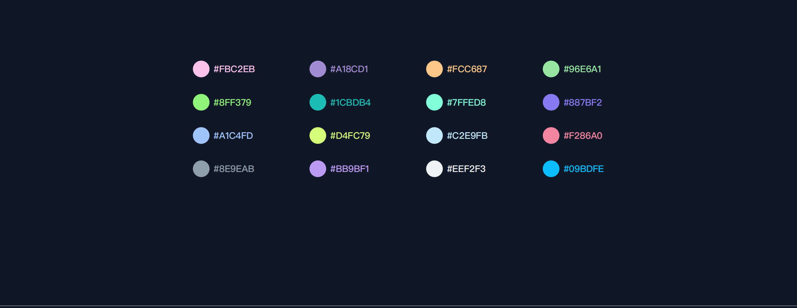

> #### 4、字体版式

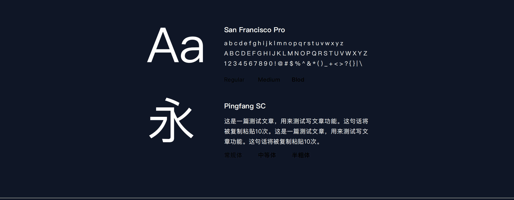

> #### 5、字体大小

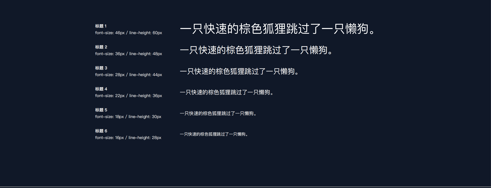

> #### 6、基础间距

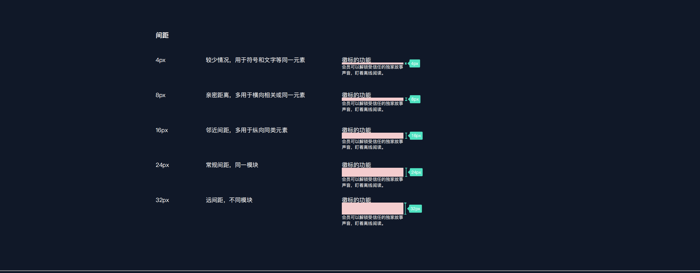

> #### 7、按钮风格

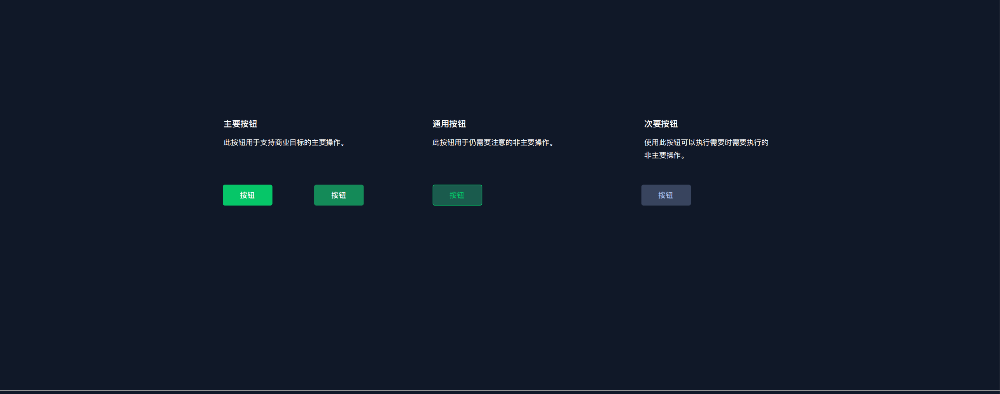

> #### 8、按钮大小

> #### 9、复选按钮

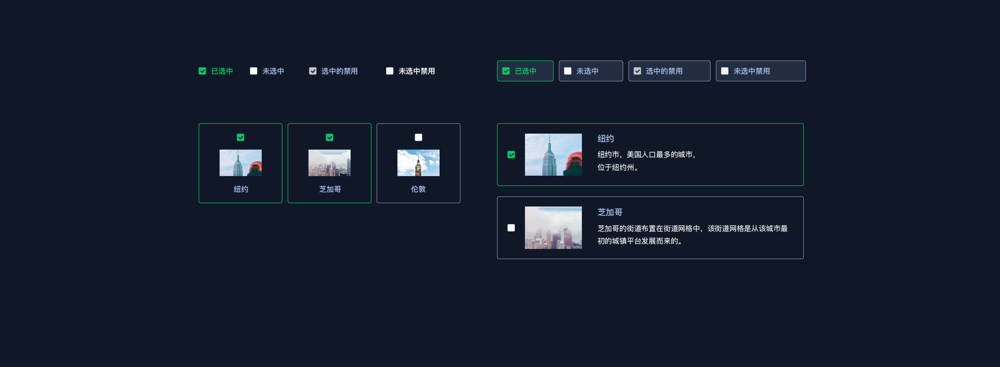

> #### 10、输入框

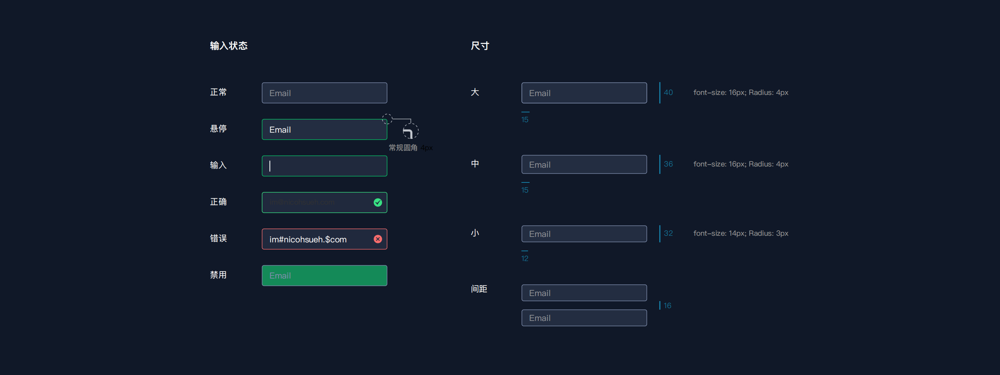
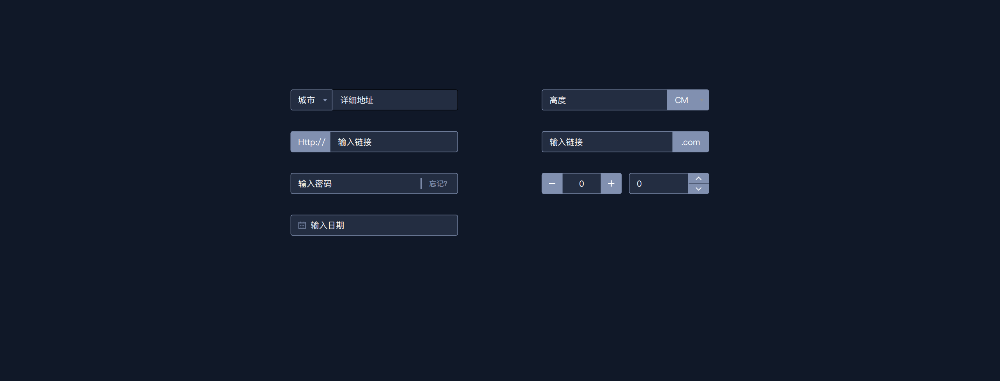

> #### 11、选择

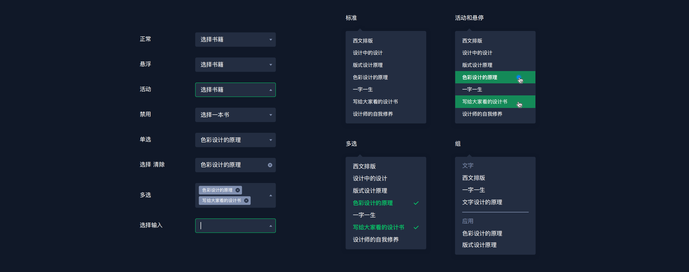

> #### 12、模块标签

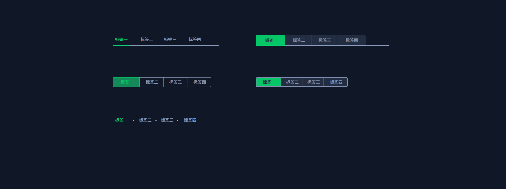

> #### 13、分页

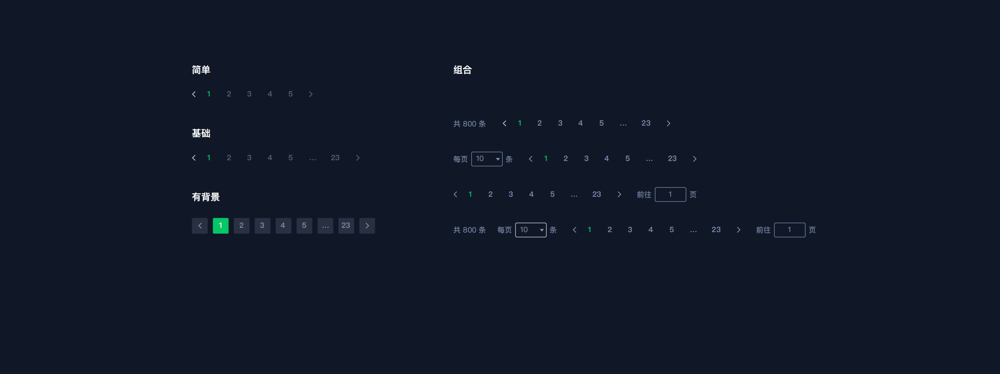

> #### 14、提示信息

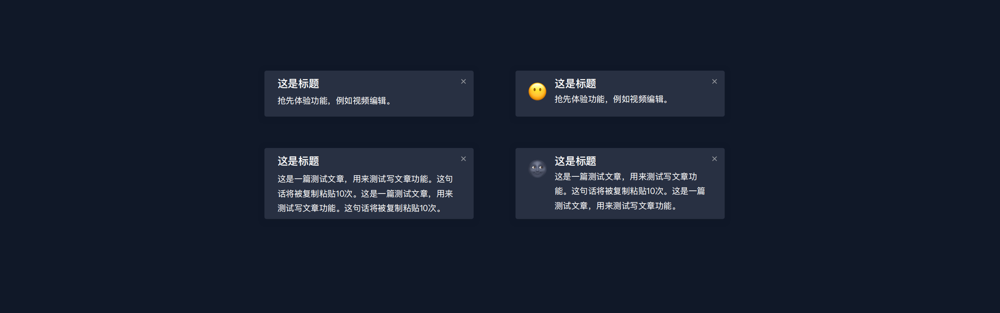
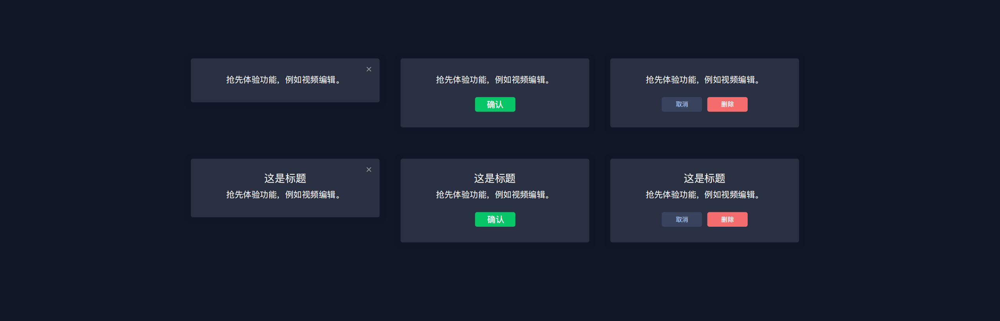

> #### 15、表格

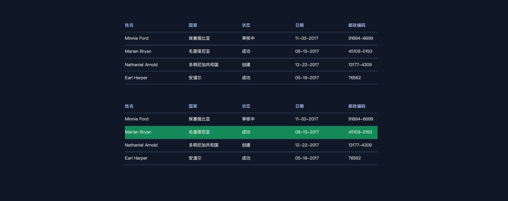
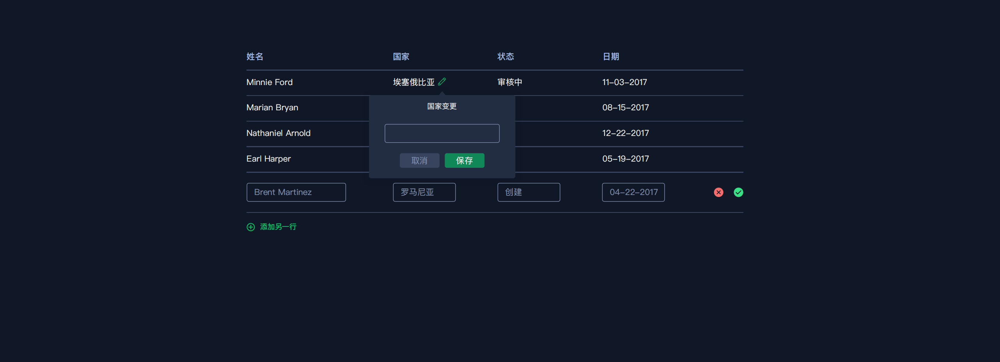

> #### 16、图标规范

> #### 17、信息规范

> #### 18、框架参考

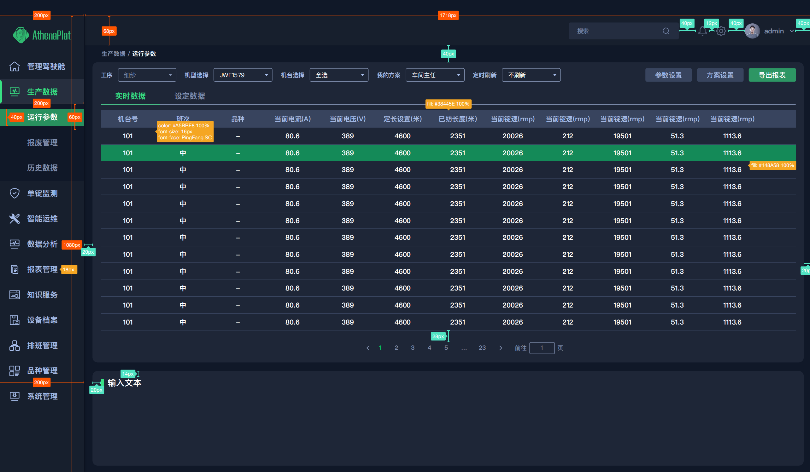
